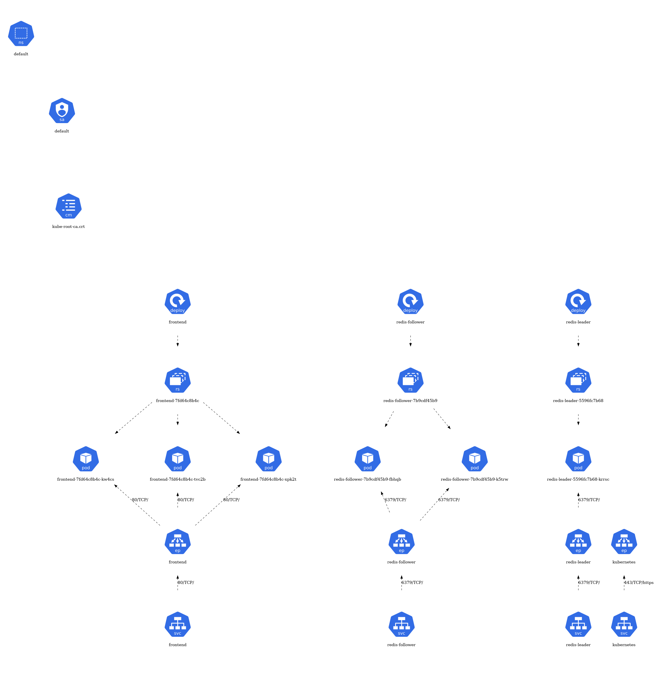

# kube-visualization

kube-visualization visualizes a namespace within a Kubernetes cluster.
Resources are represented heirarchically, in a graphviz directed graph.

## Prerequisites

Install the following:

1. [Go](https://go.dev/dl/)
2. [Docker](https://docs.docker.com/engine/install/)
3. [Graphviz](https://graphviz.org/download/)

## Configuration

- The config file contains a list of "ranked" GroupVersionResources (GVRs):

```json
{
    "resources": [
        {
            "rank": 10,
            "resource": "serviceaccounts",
            "version": "v1"
        },
        {
            "rank": 70,
            "resource": "secrets",
            "version": "v1"
        },
        {
            "rank": 100,
            "group": "apps",
            "resource": "deployments",
            "version": "v1"
        }
    ]
}
```

- A GVR is a unique identifier for a resource within Kubernetes, comprising three key elements:
  - Group: Resources are organized into "groups" e.g. `core` or `apps`.
  - Version: The version of the API e.g `v1alpha1` or `v1`.
  - Resource: This is the type of resource being referred to e.g `pods` or `deployments`.
- The "rank" is a novel concept of this application. The relative ranking of one resource to another, dicatates where
each resource is placed in the visualisation heirarchy. Resources are plotted top to bottom, with smaller ranks
appearing higher in the heirarchy. Multiple resources can share the same rank.

## Visualisation

- [Graphviz](https://graphviz.org/about/) is open source graph visualization software.
- The output of the application is a string representation of a graphviz directed graph, which may be converted,
using the `dot` application, into several useful formats such as images and SVG for web pages.
- Each Kubernetes object is represented as a node in the graph with two essential properties:
  - Label: the name of the object.
  - Image: a standardized icon used for Kubernetes architecture diagrams.
These [icons](https://github.com/kubernetes/community/blob/master/icons/README.md) are stored in the `assets/`
directory at the root of the repository and named based on the `resource` property of the GVR in the configuration file.
- Connections between related Kubernetes objects are represented as edges in the graph. An `edge` is a dotted line between
a source node and destination node. Possible connections are:
  - Ownership based: a `Deployment` owns a `ReplicaSet`. This is determined through the `ownerReferences` present
on the object.
  - Non-ownership based: The backend for an `Ingress` is a  `Service`. This is determined by inspecting known properties
on the object.

## Install

- Build the binary:

```shell
git clone https://github.com/AyCarlito/kube-visualization.git
cd kube-visualization
make build
```

- Move the binary to the desired location e.g:

```shell
mv bin/kube-visualization /usr/local/bin/
```

- Alternatively, the application is containerised through the `Dockerfile` at the root of the repository, which can
be built and run through:

```shell
make docker-build docker-run
```

## Usage

- `kube-visualization` is a [Cobra](https://github.com/spf13/cobra) CLI application built on a structure of commands,
arguments & flags:

```shell
./bin/kube-visualization --help
Allows resources in a given namespace in a Kubernetes cluster to be visualized.

Usage:
  kube-visualization [command]

Available Commands:
  completion  Generate the autocompletion script for the specified shell
  help        Help about any command
  visualize   List resources in a namespace and generate a heirarchical graph of them.

Flags:
      --assets string           Path to assets directory. (default "assets/")
      --config string           Path to configuration file. (default "config/config.json")
  -h, --help                    help for kube-visualization
      --kubeconfig string       Path to a kubeconfig file.
      --label-selector string   Filter resources by label. Comma separated key-value pairs.
      --namespace string        Namespace of resources. (default "default")
      --output string           Path to output file. (default "assets/output.dot")

Use "kube-visualization [command] --help" for more information about a command.
```

## Examples

- Follow the [Deploying PHP Guestbook application with Redis](https://kubernetes.io/docs/tutorials/stateless-application/guestbook/)
Kubernetes tutorial.
- After the resources are deployed, generate the [dot graph](./docs/guestbook.dot):

```shell
make run
```

- Convert to PNG:

```shell
make generate
```


